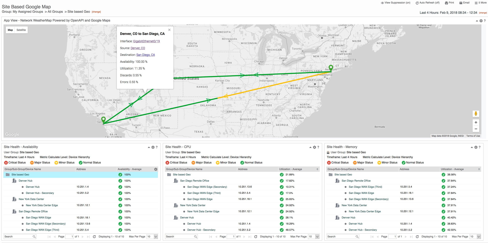

# Site to Site Network WeatherMap Powered by OpenAPI and Google Maps

An interactive Geo-Map showing Sites plotted using Geo-coordinates with interface connections.
Requires CAPM 3.5 based on Site based OpenAPI query aggregation needs.

#### Install and Configure
##### CAPC 3.5 and later:
1. Create the necessary Site groups under a common parent group
2. Populate the Longitude, Latitude, and Location Description for each site
3. Add the appropriate interfaces and devices to their corresponding Site groups
4. Create a new custom attribute on Interfaces named: ConnectsTo
5. Populate that string with the Location Description of the Site which it connects to (see step 2)
6. Wait for OpenAPI ETL process (15 minutes to 1 hour) 
7. Download Application ZIP file from the GitHub repository
8. Launch CAPC and access the Administration -> App Installer interface 
9. Select the file downloaded in step 1
   9a. If updating from a previous version of the App, please select the option to update existing apps
10. Add an App View to the CAPC Dashboard or context page
11.  Select the 'Site to Site Google Network WeatherMap' App and save the view & dashboard

NOTE: To modify the thresholds used to determine Site marker color and Connection color see line 51 and 147 of index.html file and modify as needed.

#### Parameters
1. demo : Runs the map in demo mode using the self-contained sample data set
                
===================================================================================

License (refer to license.txt in folder for 3rd party license details)

Copyright (c) 2018 CA Technologies
 
The MIT License

Permission is hereby granted, free of charge, to any person obtaining a copy of this software and associated documentation files (the "Software"), to deal in the Software without restriction, including without limitation the rights to use, copy, modify, merge, publish, distribute, sublicense, and/or sell copies of the Software, and to permit persons to whom the Software is furnished to do so, subject to the following conditions:
 
The above copyright notice and this permission notice shall be included in all copies or substantial portions of the Software.
 
THE SOFTWARE IS PROVIDED "AS IS", WITHOUT WARRANTY OF ANY KIND, EXPRESS OR
IMPLIED, INCLUDING BUT NOT LIMITED TO THE WARRANTIES OF MERCHANTABILITY,
FITNESS FOR A PARTICULAR PURPOSE AND NONINFRINGEMENT. IN NO EVENT SHALL THE
AUTHORS OR COPYRIGHT HOLDERS BE LIABLE FOR ANY CLAIM, DAMAGES OR OTHER
LIABILITY, WHETHER IN AN ACTION OF CONTRACT, TORT OR OTHERWISE, ARISING FROM,
OUT OF OR IN CONNECTION WITH THE SOFTWARE OR THE USE OR OTHER DEALINGS IN
THE SOFTWARE.

===================================================================================

